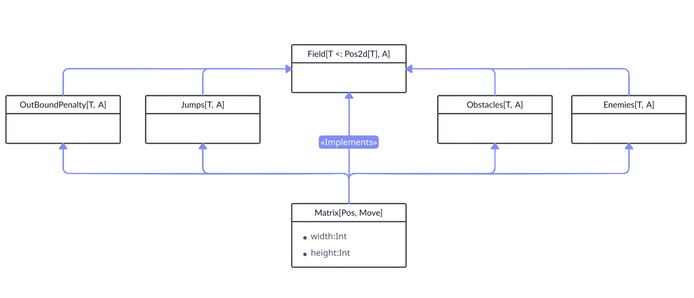
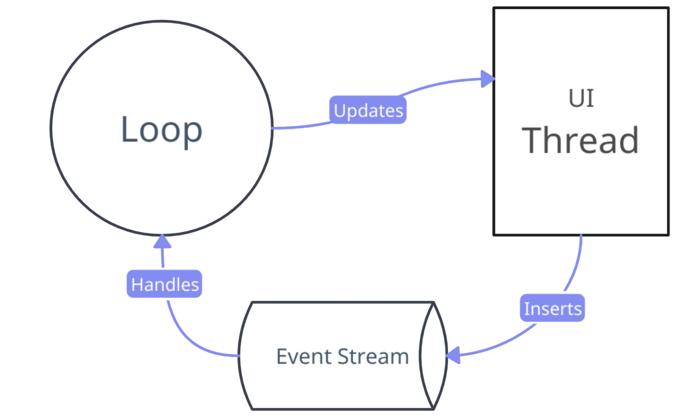
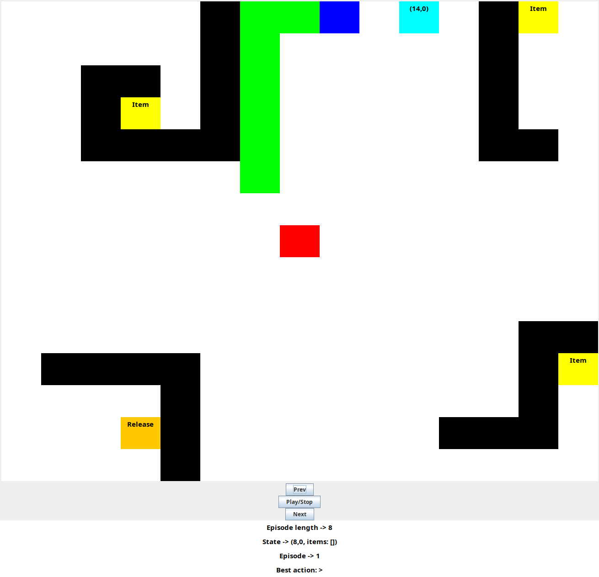

# Scala Q-Learning

This project gives a design for a Q-learning framework in Scala designed to train a robot to navigate a dynamic environment. The environment is defined by a customizable field where the robot can move, interact with objects, and receive rewards or penalties based on its actions. The framework leverages functional programming principles, including traits and mixins, to compose various behaviors for the environment, such as obstacles, enemies, or items. Additionally, it supports visualizing both the training process and the resulting learned behaviors through a GUI application built with Scala Swing.

## Basic concepts

The following sections describe the main concepts and components of the project, including the environment setup, state and actions of the robot, field extensions, and the MVC app used for visualization. Each section explains how these components work together to create custom dynamic and flexible Q-learning environments for the robot.

### Field

A ` field ` represents the environment where the Robot can move and interact with. 
 ``` 
 trait Field[S <: Pos2d[S], A] extends QRLImpl:
    val reward: PartialFunction[(S, A), Double]
    ...
 ```
- **S** is the type of the **_State_** of the robot, so everything that it **perceives** from the environment. In this design we assume that the robot always knows at least its position in the space. This is what `S <: Pos2d[S]` means.
- **A** is the type of the **_Actions_** that the robot can perform.

Since this trait extends ` QRLImpl `, it has all the functions required to perform the Q-Learning. 
```
    def qEnvironment(): Environment
    val initial: () => S
    val terminal: PartialFunction[S, Boolean]
```
The most important is the `qEnvironment()` function, that returns an **Environment**, i.e. the way that the environment **reacts** to a given **action** performed by the robot in a given **state**.

```
trait Environment extends ((State, Action) => (Reward, State))
```

Given a _state_ and an _action_, the environment object allows to know the **next state** of the robot after the action, and the **reward** obtained by this action. 
Different implementations of this function allows the robot to perceive different environments.
The **Field** trait gives also a default implementation of the _qEnvironment()_ function, that simply makes use of the **val reward** defined in the trait, that acts as the default behavior of the field. 

### Extensions

Using this design, is now possible to define different add-ons that can be applied to any **Field**. Due to the composability of functions, it is possible to define multiple `qEnvironment()` functions, and then compose them to obtain the overall desired result.

 For example, if we want to add obstacles that the robot should avoid:
```
(s, a) => if isObstacle(nextPos(s, a))
        then (Double.MinValue, s)
        else otherEnvironment(s,a)
```
This function gives the maximum negative reward to the robot, if it moves towards an obstacle, otherwise calls the _otherEnvironment()_ function.
In this case, the _otherEnvironment_, can be any **Environment**. This allows us to add obstacles to any other environment without knowing its behavior, simply **composing** the two functions. We can call those functions **reward functions**, since the only way they can change the behavior of the environment, for training purposes, is to act on the **reward** that will be assigned to the robot.

Using the same idea, in this design the composition is obtained using the [**Scala Mixins**](https://docs.scala-lang.org/tour/mixin-class-composition.html). An extension of a **Field** is just a Mixin, that implements the _qEnvironment()_ method, adding a new behavior. Each mixin is responsible for providing the response of the environment only for some specific cases (as in the previous example of obstacles). We can imagine the overall behavior of the environment as the **set** of behaviors of the individual mixins. 
The list of the available extensions are:
- **Jumps**: They allow the robot to jump from a position in the field to another.
- **Obstacles**: Positions that give a negative reward if the robot moves towards it.
- **Enemies**: Positions that gives a negative reward proportional to the distance to the robot.
- **OutBoundPenalty**: Gives the robot a negative reward if it moves outside the boundaries of the field
- **Items**: Gives the robot a reward if it picks up items from the environment, in a certain order, and then releases them in any release position.

<p align="center">

</p>

In this diagram, we can see a simple Field implementation, that represents a Matrix field with a width and a height. Using this model we can use the Scala Algebraic Data Types [**ADT**](https://docs.scala-lang.org/scala3/book/types-adts-gadts.html) to specify the set of actions that can be performed. The basic actions set that the robot can perform in a matrix field is defined by the **Move** type:

```
enum Move:
    case LEFT, RIGHT, UP, DOWN
```

This basic field is then extended, adding Obstacles, jumps, enemies and the OutBoundPenalty. In this Field the robot will now learn how to avoid obstacles, and it will try to stay away from the enemies, being careful not to go outside the boundaries of the matrix.

### State of the robot
As seen previously, the **S** generic type in the Field trait, represents the **State** of the robot. We can imagine the state as the robot's **perception** of the environment. If we want to add new sensors to the robot we should change the type S, so that it can now access more information about the environment. The minimum information he must always have access to is his **location**. This requirement is enforced defining that `S <: Pos2d[S]`. 
The _Pos2d[S]_ is a trait that has an x and a y position. In this case the **S** type parameter can contain any other State information that the robot can access to.
```
trait Pos2d[S]:
    def x: Int
    def y: Int
    def of(p: (Int,Int)): S
```
When implementing this Trait, must be specified how to update the State _S_ when only the (x, y) position of the robot changes, since the system is designed to work with immutable State objects. This can be obtained implementing the _of()_ method. 

### Matrix with items

```
trait ItemsState[T] extends Pos2d[T]:
    val items: Set[(Int, Int)]
    def of(items: Set[(Int, Int)]): T
```

Using this new state, the robot can now access also the set of items it collects on its path, since now the state contains also the **items** set. We can imagine it as a bag where the robot puts objects as it picks them up. Now it is possible to have the robot learn to pick up objects spread around the environment and, once it has collected them all, take them to a release position.

``` 
(s, a) match
    case (s, a) if isCorrectItem((s, a))  => rewardPerItem
    case (s, a) if alreadyPicked((s, a)) => Double.MinValue
    case (s, a) if cantRelease((s, a)) => Double.MinValue
    case (s, a) if canRelease((s, a)) => rewardPerRelease * s.items.size
    case (s, a) => default reward function
```

In this pseudocode we can see the **reward function** of the items mixin. This reward logic is enough to allow the robot to learn how to pick up the items in the environment and then release them in a release position. For example, we can assign the maximum negative reward if the robot tries to move towards a release position without having all the items collected. In this way the robot will learn that it can move to a release position only when it has collected all the items.

## Usage

Using the mixins mechanism we can compose our preferred field type, including all the extensions that we need. 

```
class M[S <: ItemsState[S]](...)
    extends Matrix[S](...)
      with Items[S, Move](...)
      with Obstacles[S, Move](...)
      with Jumps[S, Move](...)
      with OutBoundPenalty[S, Move](...)
      with Enemies[S, Move](...)
```

Once we have defined the field class we want to use, we can instantiate an object on which we are going to perform the training. 

```
val q1 = model.makeLearningInstance().learn(episodes, epLength, model)
```

We can now train the model and obtain the final Q-table. At this point it is possible to visualize the best policy that the robot learned during the learning phase.

```
val show = model.show(matrix(rl.width, rl.height, items))

println(show(s => "%2.1f".format(q1.vFunction(s))))
println(show(model.printJumps(q1)))
```
The Field trait also makes available a way to format the Field as a **string**. The _show_ method needs two parameters:
- The set of _states_ that we want to format and visualize. 
- A function that defines how we want to format each individual state in the string.

 Each Mixins defines its implementation of the show method. Others may define methods that need additional information to format the state. In the previous example the **printJumps()** method allows to print the jumps basing on the best actions in the Q-Table.
 A set of Example are available in the **example** package.

 ## MVC App
It is possible to visualize both the training phase, and the after-training phase, with an MVC app that has a GUI. The whole app is implemented in a Monadic fashion, using the [Cats](https://typelevel.org/cats/) library.

### Model
The model component handles the state of the visualization process, given the history of the robot. The **History**, is an object that store for each episode and for each step in the episode, the _State S_ and the corresponding _Q-Table_ that was present during that step. 
``` 
type History[Q] = Seq[Seq[(S, Q)]]
```

The _history_ can be derived from the paths taken by the robot during training. In this way, it is also possible to observe the evolution of the Q-table. Similarly, history can be derived after training by having the robot perform several episodes, but without updating the Q-Table. Thus using the history, it is possible to generalize the model, allowing any sequence of episodes to be visualized.
```
case class ModelState[S <: Pos2d[S]](step: Int, episode: Int, path: Seq[S]):
  def next[Q](hist: History[Q]):ModelState[S]
  def prev[Q](hist: History[Q]):ModelState[S] 
```
 The **ModelState** is an immutable class that contains the current **episode**, the current **step** of the visualization. The _path_ field, is the path the robot has taken up to that point, in the same episode. It also makes available the operations to update the state, computing the _next_ ModelState and the _previous_ ModelState.

 ### View
 The GUI is implemented using the [Scala-Swing](https://index.scala-lang.org/scala/scala-swing) library, that wraps most of Java Swing for Scala in a straightforward manner. The main class that handles all the UI elements is the **Window** class.
 ```
case class Window(...) extends JFrame:
``` 
Unlike all the other elements seen before, this class is mutable. It means that all the operations made on the view, will not be pure function, but they will update the internal state of the window object. We can avoid this problem using the **State** Monad. 
`State[S, A]` is basically a function `S => (S, A)`, where _S_ is the type that represents the state and _A_ is the result the function produces. In addition to returning the result of type _A_, the function returns a new _S_ value, which is the updated state.

```
 def withSize(width: Int, height: Int): State[Window, Unit] =
    State.modify{_.copy(w = width, h = height)}
```
This is an example of a function that returns a state Monad that simply updates the state of the window, modifying its dimension, without producing any result (Unit). All the operations that can be performed on the Window, were implemented using this approach.

### Event-loop

The application uses a revisiting of the **event-loop** architecture, in order to be responsive to user input. The loop is also implemented using the _State_ Monad. 
```
private def loop[A](cond: State[A, Boolean])(delay:Int): State[A, Unit] = {
    cond flatMap { bool =>
      if (bool)
        Thread.sleep(delay)
        loop(cond)(delay)
      else State.empty
    }
  }
```
This function recursively calls the same State Monad _cond_, until it produces a result that is **False**. We can imagine the _cond_ as being the body of a **while loop** , while its result is the condition of the loop. Since the application should not terminate until the user exits, we can make the recursion go in an infinite loop passing a _cond_ State that always produces **true**. The delay is used to allow the _EDT_ to render the updates. We can use this implementation thanks to the fact that the State Monad is **stack safe**, otherwise the infinite loop would end up causing a stack overflow.

### Controller
The controller allows it to react to user input and update the model accordingly. This component is also implemented using the State Monad. In this case the overall State is the composition of the **Window** State, and the **ModelState** State.
```
State[(ModelState[S], Window), A]
```
Each input is then queued in an **Event-stream**, that keeps track of the updates that must be processed. 

```
val app = for
       e <- eventStream()
       _ <- handle(e) {
          case "prevButton" => handlePrev
          case "nextButton" => handleNext
          case "stopButton" => (for
              _ <- autoplay()
            yield ()).!
       }
    yield true //  loop condition
```

This **app** Monad is then passed to the loop function.
Using this approach will cause the program to process all the events accumulated in the event stream, in the same **loop cycle**. 

<p align="center">

</p>

 After handling all the events, the app State Monad returns true. This value will then be evaluated in the _loop_ state monad seen earlier, which will **recursively** call the _app_ monad, which will consequently handle new events and produce a new boolean value. Since we passed true, this flatMap chain calls will cause an **infinite** loop. For simplicity, the events were modelled as strings.
The app also includes an **autoplay** button that automatically keeps adding the same event to the event stream.

All the operations performed on the State of the app can be implemented using the monadic operations of the View. 

```
val updateLabels:ModelState[S] => State[Window, Unit] = m =>
      for
        _ <- updateLabel("ELength", "Episode length -> ... ")
        _ <- updateLabel("state", "State -> ...")
        _ <- updateLabel("episode", "Episode -> ...")
      yield ()
```
In this example, the updateLabels State Monad, will update the Window, changing the values of the labels.

### Running the app

It is possible to run the application, by calling the loop Monad, using the app as parameter, as seen earlier. 
```
loop(app)(30).run((ModelState(0,0,List()), w)).value._1
```
Here we specify the initial values on which we want to apply the Monad, passing the initial _ModelState_ of the app.

# Usage
To run the app we need to use the *CreateGui* method defined by the MVC app.
```
def createGui[S <: Pos2d[S],A](f:Field[S, A])(mapper:(Int,Int) => Cell)
                                (hist: LazyList[LazyList[(S,f.Q)]]): Unit =
```
This function needs the _field_ that we want to visualize, the _history_ and a _mapper_. The mapper parameter allows us to choose in which way, each position in the field should be **visualized**. 
```
createGui(model, 40)(borderGrid
      .showItems(model.items.values.toSet, model.releasePos)
      .showObstacles(model.obstacles)
      .showEnemies(model.enemies))(hist)
```
Since the _mapper_ is a function, we can easily compose different mappers to customize the **appearance** of the _field_.  


It is important to note that, passing the history as a **LazyList**, allows the app to compute the episodes at runtime. In this way there is no need to wait that all the history is computed before we can visualize it. 

There are two ways to create the **History** on which we want to run the app:
- `def learningHist(q: Q)(episodes: Int, length: Int)`: this function allows to visualize the history of the **training** phase.
- `def nRuns(q: Q)(episodes: Int, length: Int)(g: () => State)`: this function perform a number of episodes with the given Q-Table, without updating it. The _g_ function is used to generate the initial State for each episode.

<p align="center">

</p>

Once we run the app, we can interact with the steps of the episodes, using the **next** and **prev** buttons.
We can use the **autoplay** button to automatically visualize the episodes.
We can also visualize the current **State** of the robot, the current **Episode**, the **Episode length** and 
the **best action** that the robot should perform in the current state, considering the current  Q-Table.


